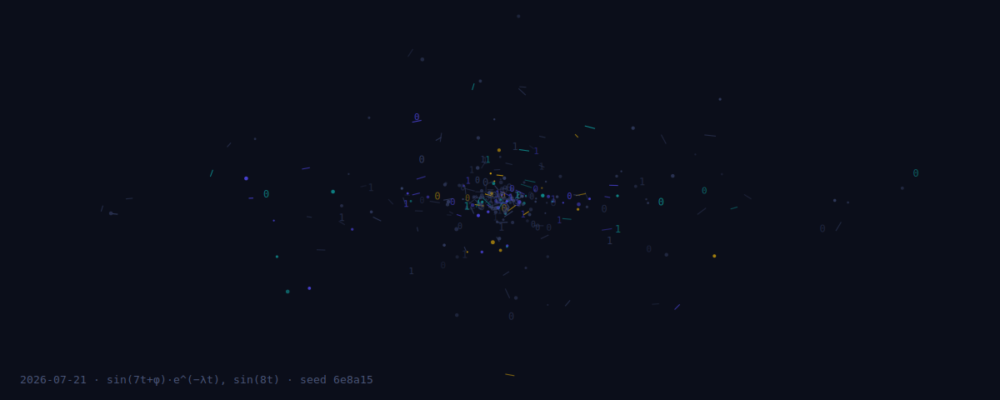

AI/ML engineer working on **verified primitives** — systems that compose verified components instead of trusting bigger models.
Currently building LLM evaluation and observability tooling.

## Selected work

- **[Chronos](https://github.com/Sai-Teja-Meka/Chronos)** — event-sourced time-travel debugger for LLM conversations: rewind, fork "what-if" branches, compare timelines. v0.1.0, 29 ms median replay on a 1,050-event conversation.
- **[Agent-Persona-Engine](https://github.com/Sai-Teja-Meka/Agent-Persona-Engine)** — chat with characters from a novel, grounded in the actual text, with persistent hybrid memory (Neo4j + ChromaDB).
- **[∞ Forge](https://github.com/Sai-Teja-Meka/infinity-forge)** — self-compounding verified code library: 9 hand-written seeds → 114 LLM-generated atoms → 11,509 functions verified for correctness through a six-layer cascade, no LLM in the compounder; 59.7% / 46.8% of L2/L3 survivors additionally exhibit behaviorally rich output ([measured](https://github.com/Sai-Teja-Meka/infinity-forge/blob/main/RESULTS.md)).

## Today's iteration

Regenerated daily by a GitHub Action — same rule, new seed.

## Contribution graph

<picture>
  <source media="(prefers-color-scheme: dark)" srcset="https://raw.githubusercontent.com/Sai-Teja-Meka/Sai-Teja-Meka/output/github-snake-dark.svg" />
  <source media="(prefers-color-scheme: light)" srcset="https://raw.githubusercontent.com/Sai-Teja-Meka/Sai-Teja-Meka/output/github-snake.svg" />
  
</picture>

  
  

  

